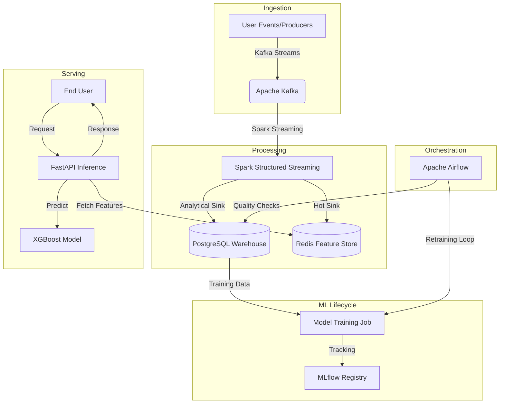

# 🛡️ FraudGuard: Enterprise Real-Time Data Warehouse + ML System

[](https://www.python.org/)
[](https://www.docker.com/)
[](LICENSE)

FraudGuard is a production-grade, end-to-end MLOps platform designed to detect financial fraud in real-time. It leverages a **Lambda Architecture** to combine high-speed stream processing with robust batch retraining.

---

## 🏗️ System Architecture



---

## 🚀 Key Features

*   **Real-Time Feature Engineering**: Spark calculates 10-minute sliding window aggregates with sub-second latency.
*   **Low-Latency Inference**: FastAPI + Redis integration ensures <50ms prediction response times.
*   **Automated MLOps**: Airflow triggers weekly retraining cycles and logs models to MLflow.
*   **Futuristic UI**: High-performance React + Vite "Command Center" for real-time monitoring.
*   **Operational Dashboard**: Glassmorphic Streamlit UI for deep analytical insights and manual inference testing.


---

## 📂 Project Structure

```text
├── ingestion/          # Kafka producers & data simulation
├── processing/         # Spark Structured Streaming logic
├── training/           # MLflow training pipelines (XGBoost)
├── serving/            # FastAPI Inference microservice
├── dashboard/          # Streamlit UI (Premium Design)
├── orchestration/      # Airflow DAGs for retraining
├── monitoring_drift.py # Data drift analysis scripts
└── docker-compose.yml  # Full-stack orchestration
```

---

## 🛠️ Installation & Setup

### 1. Prerequisites
- **Docker & Docker Compose** (Recommended: 4GB+ RAM for the cluster)
- **Python 3.9+**

### 2. Launch the Environment
```bash
docker-compose up -d --build
```
This command builds the custom images and starts the entire 8-service cluster.

### 3. Access Points
- **Primary UI (React)**: `http://localhost:3000`
- **Internal Monitoring (Streamlit)**: `http://localhost:8501`
- **Inference API**: `http://localhost:8000/docs`
- **MLflow Tracking**: `http://localhost:5000`
- **Airflow UI**: `http://localhost:8082`


---

## 🧠 Technical Highlights

*   **Exactly-Once Processing**: Implemented via Spark checkpoints and PostgreSQL transactional sinks.
*   **Model Versioning**: Uses MLflow Model Registry to promote models from `Staging` to `Production` without code changes.
*   **Scalability**: Kafka partitions and Spark executors can be scaled horizontally to handle millions of users.

---

## 🤝 Contributing
Contributions are welcome! Please open an issue or submit a pull request for any improvements.

## 📄 License
This project is licensed under the MIT License - see the [LICENSE](LICENSE) file for details.

---
**Built by a Senior Data & ML Architect** 🚀
